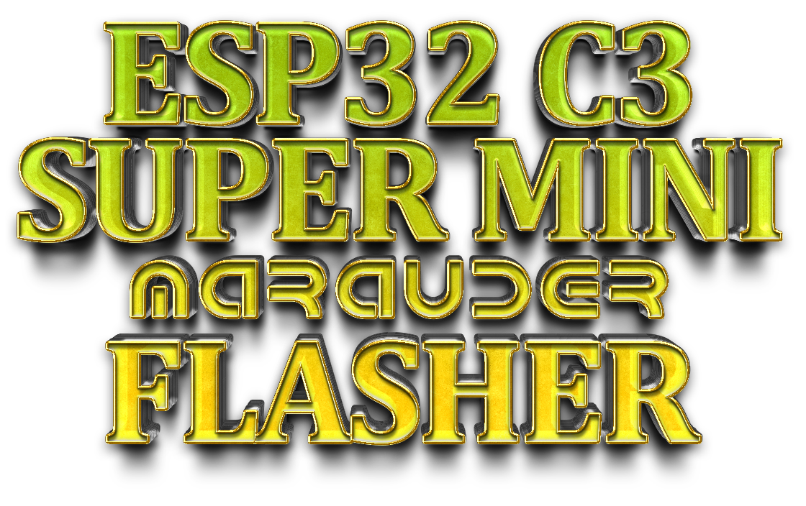
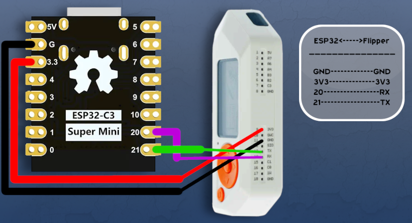

 

  

## ⬆ ESP32-C3 Super Mini Update Highlights 6/4/25 ⬆   Added New v1.6.2!

---

📡 ESP32-C3 Super Mini WiFi Marauder Fork 🚀  
A powerful fork of the WiFi Marauder suite, adapted for the ESP32-C3 Super Mini!  
This version brings the latest features, fixes, and improvements for WiFi/Bluetooth offensive and defensive tasks.  
Ideal for pentesters, hackers, and hobbyists alike!  
 
Run your Marauder setup efficiently on the compact and affordable ESP32-C3 Super Mini. Contributions are welcome! 🎉
 

| 🖥️ Serial Connection 🖥️ |
| ---- |
| No serail connection at this time, but I am working on the issue. |

---

> # 🛠️ **Device Compatibility**
> 
> Successfully tested on:
> - [ESP32-C3 Super Mini](https://www.aliexpress.us/item/3256806832819523.html?channel=twinner )  
> - [Other ESP32-C3 Variants]

---

# ➰ **Wiring Diagram** 

---

# ⚡ **Web Flasher**  
Use the link below to flash Wifi Marauder onto a ESP32C3 Super Mini with the web flasher tool!  
 
<a href="https://atomnft.github.io/ESP32_C3_SuperMini_Marauder_Flasher/flash0.html">Web Flasher Tool</a>

<button name="button" onclick="http://www.google.com">Click me</button>

---

# 📢 Shoutouts & Links! 📢
A huge shoutout to the man <a href=https://github.com/justcallmekoko>JustCallMeKoko</a>for the foundational work on ESP32 Marauder.

<h2>ESP32 Marauder Stock Info & Links</h2>

# ESP32 Marauder  

  

  <b>A suite of WiFi/Bluetooth offensive and defensive tools for the ESP32</b>  
    
  
  
  
   
  
  
    
  
   
  

# Getting Started  
Download the [latest release](https://github.com/justcallmekoko/ESP32Marauder/releases/latest) of the firmware.  

Check out the project [wiki](https://github.com/justcallmekoko/ESP32Marauder/wiki) for a full overview of the ESP32 Marauder  

# For Sale Now  
You can buy the ESP32 Marauder using [this link](https://www.tindie.com/products/justcallmekoko/esp32-marauder/)

